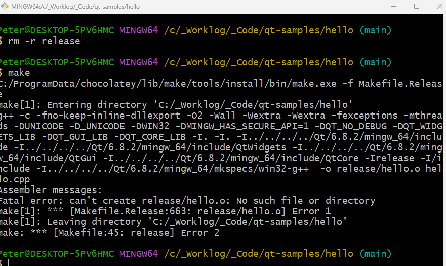

# Notes on `minimal-sample` for `Qt`

## `Saturday, 2/8/25`

- Created a _very_ minimal implementation of this project, with just one file and confirmed:
- `CONFIG -= entrypoint` is required to be added to the generated `*.pro` file (at least on windows)
- Got a linker error"



- Also, had to change the signature of main from:

```c++
int main(int argc, char *argv[])
```
- To: 

```c++
int main(int argc, char **argv)
```
- Changed it back _after_ a successful build and now it works with the original signature
- Ran `rm -r release` to delete the compiled binaries
- (Actually, `rm release/**` is better since the compiler depends on it existing)
- Or just recreate prior to the next step
- After this, tried to compile and got the linker error again
- So, now, confirmed the second signature is required
- Will try this same thing on my linux machine and see what happens

- Working from [this](https://www.linux.org/threads/c-tutorial-create-qt-applications-without-qtcreator.18409/) example
- Attempting to create a minimal `Qt` sample on `Windows` (for now)
- This looks pretty cool and runs (so far), but a lot of it doesn't work right
- For example, I can't seem to either `setText` nor `appendText` to the `QTextBrowser` variable `textBlock_`
- This causes a _segmentation fault_
- Also, the process doesn't appear to connect and run, correctly
- Not sure what I am doing wrong here

### `Previous` &rarr; `Installation\Setup` on Windows

- From an _elevated command prompt_ run:
  - `choco upgrade chocolatey`
  - `choco install make`
  - Added `Qt` bin folder on my machine `C:\Qt\6.8.2\mingw_64\bin` to my path
  - Could now run `qmake` from `Git bash` and follow along with the tutorial
  - Encountered link errors appearing to be related to `Windows entry points`
  - Had to add `CONFIG -= entrypoint` to my project file and was able to compile and run
  - Need to research this more to understand exactly what the problem is, \
  but see comments in my documents repo on this
  - See `Solution` [here](https://forum.qt.io/topic/137730/how-to-disable-linking-with-qt6entrypoint-in-qmake)