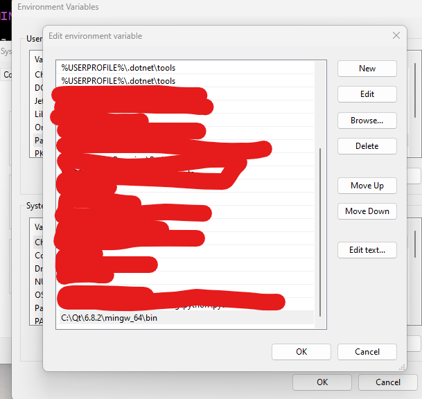
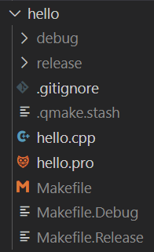

# Run `qmake` or `make` Based Projects from the command-line

## `Windows`

### Prerequisites

- `make` is installed (I used `chocolatey`)
- Location for `Qt` binaries is added to the user's path:

- `CONFIG -= entrypoint` is added to the project file (`{project-name}.pro`), otherwise I got a linker error (on Windows)
- TODO: Research this further to understand _exactly_ what is going on, _Windows vs. Linux_

##@ To Generate Makefile(s)

- Run `qmake {project-name}.pro`
- On `windows` this creates the following files/directories (shown in gray)

- `debug`
- `release`
- `.qmake.stash`
- `Makefile`
- `Makefile.Debug`
- `Makefile.Release`

### To Build

- Run `make` (defaults to `release` target) or `make debug` as desired

### To Run

- Run `./release/hello.exe` or `./debug/hello.exe` as desired